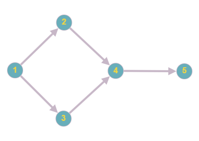
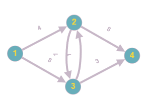
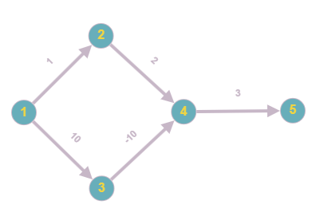

# Graphs

| Algorithm                                                                        | Time Complexity          |
| -------------------------------------------------------------------------------- | ------------------------ |
| [Bellman-Ford](https://en.wikipedia.org/wiki/Bellman%E2%80%93Ford_algorithm)     | `O(\|V\|\|E\|)`          |
| [Breadth-First Search (BFS)](https://en.wikipedia.org/wiki/Breadth-first_search) | `O(\|V\|+\|E\|)`         |
| [Depth-First Search (DFS)](https://en.wikipedia.org/wiki/Depth-first_search)     | `O(\|V\|+\|E\|)`         |
| [Dijkstra's](https://en.wikipedia.org/wiki/Dijkstra's_algorithm)                 | `O(\|V\|+\|E\|log\|V\|)` |

## Notes

- `|V|` - number of vertices/nodes
- `|E|` - number of edges/arcs

## Test Graphs

| Graph | Description                           | Image                       |
| ----- | ------------------------------------- | --------------------------- |
| A     | An unweighted digraph                 |  |
| B     | A positively-weighted digraph         |  |
| C     | A digraph containing negative weights |  |
